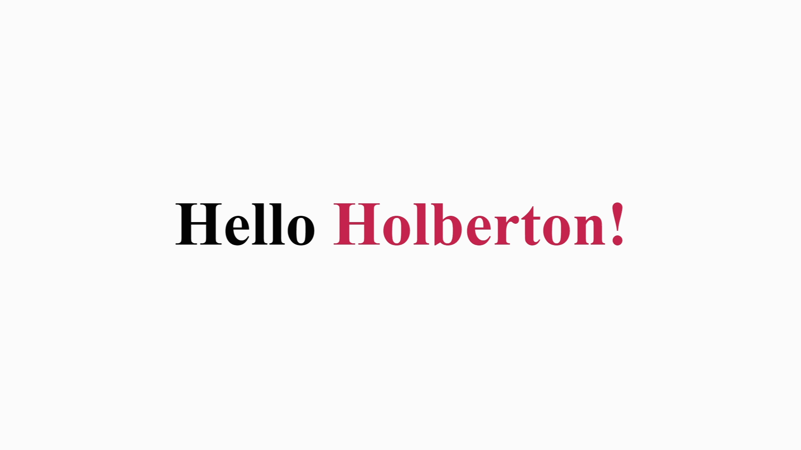
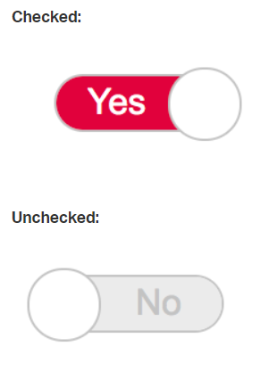
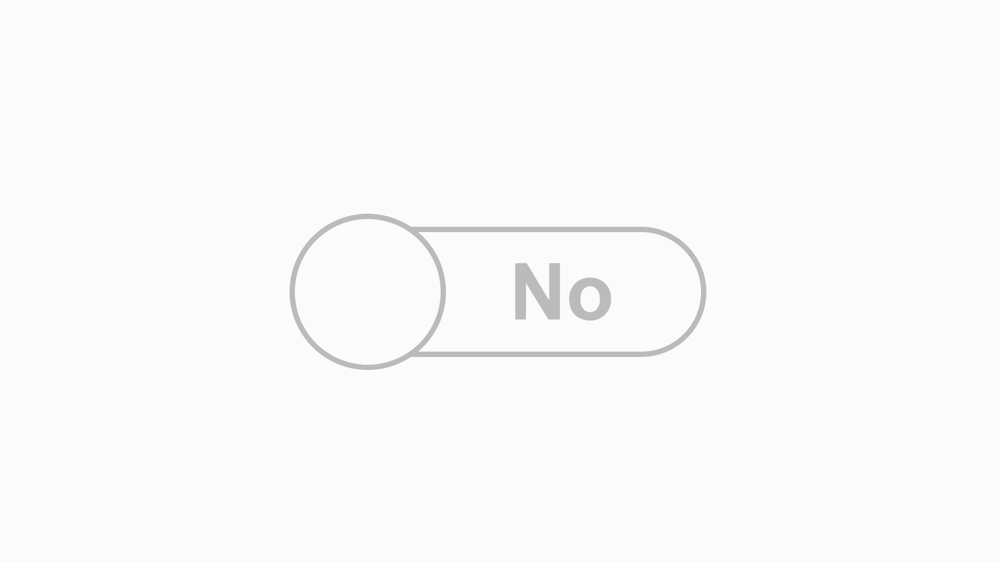

# Fun With CSS
### Learning Objectives:
This project is a challenge to experiment with and implement layouts using HTML and CSS ONLY!

Yes

No JavaScript!

---
### 0. Sprite languages
#### Layout:
By using the html in [0-Spritelanguages.html](**0-Spritelanguages.html**) and the image [0-sprite.png](**0-sprite.png**), generate the given layout using only CSS.

You're not allowed to change the image nor the HTML, *sprites are cool!*

Solution: [0-styles.css](0-styles.css)

---
### 1. Move the (under)line
#### Layout:

Generate this layout where the underline is hidden by default and appears slowly

html: [1-line.html](1-line.html)

Solution:

[1-styles.css](1-styles.css)

---

### 2. Toggle
#### Layout:

Generate this layout where the <input> has this custom toggle

Solution:

[2-styles.css](2-styles.css)

---

### 3. Menu
#### Layout:

Generate this layout/animation

Solution:

[3-styles.css](3-styles.css)
